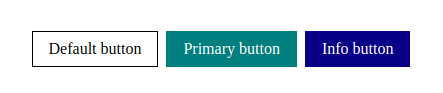

# 🎨 UI Components Document

## Danh sách components

Liệt kê đầy đủ các component tại đây. Có thể sort theo bảng chữ cái (a -> z) để tiện cho việc tìm kiếm trong trường hợp có quá nhiều components

- [Button](#button)

## Chi tiết

Mô tả chi tiết của từng UI Component, cụ thể bao gồm:

- Preview nếu có
- Mô tả về component (dùng cho mục đích gì, nếu tên component đã đủ giải thích thì bỏ qua)
- Cú pháp (import, render, ...)
- Mô tả params/props cần truyền vào

### Button



```js
import Button from "./components/Button";

// Cú pháp tùy thuộc vào công nghệ đang dùng
// Ở đây mình dùng React.js
<Button type={type} onClick={onClick}>
  Text
</Button>;
```

| Prop      | Description                                    | Type              | Required | Default Value |
| --------- | ---------------------------------------------- | ----------------- | -------- | ------------- |
| `type`    | Style của button, bao gồm `primary` và `info`. | `string`          | `fasle`  | --            |
| `onClick` | Hàm được chạy khi nhấn vào nút.                | `function(event)` | `false`  | --            |

Nếu cách viết table như trên khó quá thì có thể dụng dạng HTML như sau:

**Lưu ý:** cách viết HTML sẽ không hỗ trợ markdown ở phía trong nội dung.

<table>
  <thead>
    <tr>
      <th>Prop</th>
      <th>Description</th>
      <th>Type</th>
      <th>Required</th>
      <th>Default value</th>
    </tr>
  </thead>
  <tbody>
    <tr>
      <td>type</td>
      <td>Style của button, bao gồm `primary` và `info`.</td>
      <td>string</td>
      <td>false</td>
      <td>--</td>
    </tr>
    <tr>
      <td>onClick</td>
      <td>Hàm được chạy khi nhấn vào nút.</td>
      <td>function(event)</td>
      <td>false</td>
      <td>--</td>
    </tr>
  </tbody>
</table>
