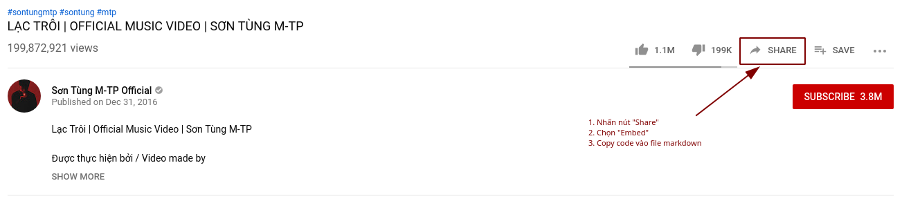

# 🌀 Guide Document

## Giới thiệu

> Giới thiệu, giải thích chung về hướng dẫn hoặc mục tiêu (kết quả) có được khi làm theo hướng dẫn.

Nút **Thiết lập vị trí** nằm trong dashboard của một _UI/UX Addon_ cụ thể, được sử dụng chung với plugins _Thiết lập vị trí Addon_ của _EGANY Tools_. Plugins này sẽ cho phép người dùng thiết lập vị trí custom cho addon (`#id`, `.class`) ngay trên giao diện màn hình.

**Lưu ý:** Mỗi addon có thể không có hoặc có nhiều hơn một nút **Thiết lập vị trí** tùy theo yêu cầu của addon.

## Chi tiết

> Bao gồm 2 phần chính:
>
> - Mô tả về cấu trúc, nguyên lý hoạt động nếu có
> - Các bước thực hiện. Nếu có các lưu ý đặc biệt thì nên thêm vào phần này
>
> Nếu phần lưu ý tương đối dài, cần giải thích kĩ thì có thể tách ra riêng thành một section hoặc thậm chí là một document riêng để dễ theo dõi.

### Cấu trúc

> Mô tả cấu trúc, ở đây là cấu trúc `href` của trang thiết lập vị trí

**Thiết lập vị trí** sẽ được mở ra ở một tab mới trên trình duyệt. `href` của trang **Thiết lập vị trí** sẽ bao gồm các thành phần sau:

| Tên          | Mô tả                                                                                           | Ví dụ                                            |
| ------------ | ----------------------------------------------------------------------------------------------- | ------------------------------------------------ |
| `page`       | Trang chứa addon trên theme của khách hàng, ví dụ: sản phẩm, cart, checkout ...                 | https://thanhnt.myharavan.com/products/nike-shoe |
| `ega-addon`  | `appKey` của addon.                                                                             | sales-countdown, smart-search, ...               |
| `name`       | Tên đầy đủ của addon, có hỗ trợ tiếng Việt có dấu nhưng không khuyến khích                      | Sales Countdown, EGANY Tools, ...                |
| `query-prop` | `key` của settings cần thay đổi. Có thể đi nhiều cấp, mỗi cấp phân biệt bằng một dấu chấm `.`   | `query`, `button.text`, `position.query`         |
| `from`       | `window.location.origin` của dashboard để phía extension có thể trả về kết quả khi set position | `https://wa-dev.egany.com`                       |

### Các bước thực hiện

> Mô tả chi tiết từng bước.
>
> Ở đây là thiết lập trong source code nên sẽ có code sample. Nếu như là hướng dẫn thao tác trên giao diện thì nên làm dưới dạng hình ảnh, có step trên hình (khoanh vùng, mũi tên, chú thích, ...).
>
> Cách thêm hình ảnh, video thì tham khảo ở bên dưới.

**1. Gắn nút thiết lập vị trí**
Style của nút sẽ do developer quyết định. Tuy nhiên, bắt buộc như sau event onClick phải như bên dưới

```js
// ...
setPositionButton.addEventListener("click", () => {
  // Mở đường dẫn trang thiết lập vị trí ở một tab mới.
  window.open(setPositionPageUrl, "_blank");
});
// ...
```

**2. Gắn event listener để nhận kết quả trả về**

Sau khi thiết lập vị trí thành công, extension sẽ trả ngược về dashboard một object với dạng như sau:

```js
{
  [query-prop]: "#add-to-cart"
}
```

Để nhận kết quả, trong trang dashboard cần có một event listener như sau:

```js
// ...
let handleMessage = event => {
  let { data } = event;
  if (data && data.type === "set-addon-position") {
    let queryObject = data.payload;
    // cập nhật state (nếu có)
    // lưu setting
  }
};
window.addEventListener("message", handleMessage);
// ...
```

**Lưu ý**: Khi dashboard tắt hoặc người dùng chuyển trang thì developer **bắt buộc** phải xóa event listener đi để đảm bảo project chạy đúng. Cách thực hiện như sau:

```js
window.removeEventListener("message", handleMessage);
```

### Hình ảnh / Video hướng dẫn

**Dạng hình ảnh**

```md


Ví dụ:

```



**Dạng video**

Do [_Github_](https://github.com) không hỗ trợ video nên buộc chúng ta phải làm theo hướng dẫn [tại đây](./guides/embed-video.md)
